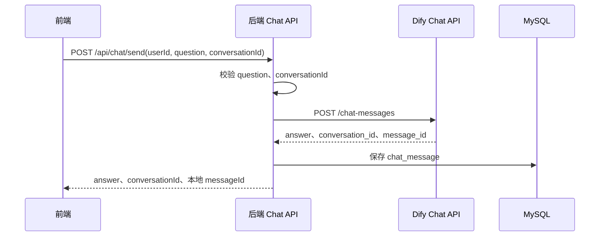
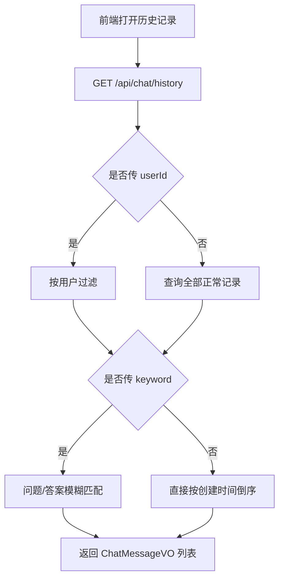
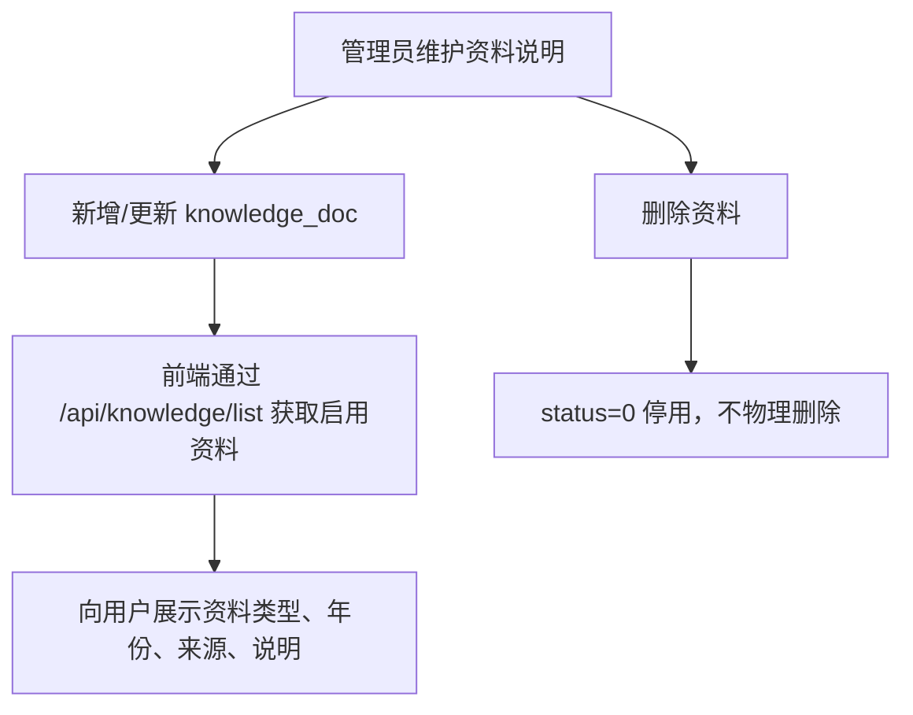
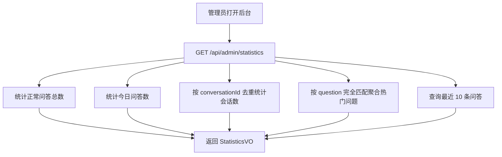

# 高考 RAG 后端技术对接文档

## 1. 项目概述

本项目是一个基于 Spring Boot 的高考问答/RAG 后端服务。系统通过 Dify Chat API 完成 AI 问答与知识库检索，本地 MySQL 负责保存用户问答记录、会话标识、知识库资料说明和后台统计所需数据。

当前后端不直接维护向量库、知识库原文或 RAG 检索逻辑；这些能力由 Dify 应用及其知识库承载。后端主要承担：

- 为前端提供统一 REST API。
- 调用 Dify `/chat-messages` 获取 AI 回答。
- 保存问答记录，支持历史记录、会话记录、软删除。
- 维护知识库资料说明，用于前端展示资料来源、类型、年份等元信息。
- 提供后台统计数据。

## 2. 技术栈

| 类别 | 技术 |
| --- | --- |
| 运行时 | Java 17 |
| Web 框架 | Spring Boot 3.3.5 |
| ORM | MyBatis-Plus 3.5.9 |
| 数据库 | MySQL 8.x 兼容 |
| HTTP 客户端 | Spring `RestClient` + JDK `HttpClient` |
| 构建工具 | Maven |
| 外部 AI 服务 | Dify Chat API |

## 3. 模块结构

```text
src/main/java/com/example/gaokao
├── client              Dify API 客户端
├── common              统一响应、全局异常处理
├── config              CORS、Dify 配置
├── controller          REST API 控制器
├── dto                 请求/响应 DTO
├── entity              数据库实体
├── mapper              MyBatis-Plus Mapper
├── service             业务接口
├── service/impl        业务实现
└── vo                  前端展示对象
```

核心类说明：

| 类 | 职责 |
| --- | --- |
| `ChatController` | 问答、历史记录、会话记录、消息删除接口 |
| `ChatServiceImpl` | 参数校验、调用 Dify、保存问答记录 |
| `DifyClient` | 组装 Dify 请求，处理 Dify 响应和异常 |
| `KnowledgeController` | 知识库资料说明的增删改查 |
| `KnowledgeServiceImpl` | 知识库资料说明校验、启停状态维护 |
| `AdminController` | 后台统计接口 |
| `AdminServiceImpl` | 统计总提问数、今日提问数、会话数、热门问题、最近消息 |
| `GlobalExceptionHandler` | 统一异常响应 |

## 4. 运行与配置

### 4.1 基础配置

默认配置文件：`src/main/resources/application.yml`

| 配置项 | 默认值 | 说明 |
| --- | --- | --- |
| `server.port` | `8080` | 后端服务端口 |
| `spring.datasource.url` | `jdbc:mysql://localhost:3306/gaokao_rag...` | MySQL 连接地址 |
| `spring.datasource.username` | `root` | 数据库用户名 |
| `spring.datasource.password` | `root` | 数据库密码 |
| `dify.base-url` | `https://api.dify.ai/v1` | Dify API 地址 |
| `dify.api-key` | `your-dify-api-key` | Dify 应用 API Key |
| `dify.response-mode` | `blocking` | 当前按阻塞模式处理回答 |
| `dify.connect-timeout-ms` | `10000` | Dify 连接超时 |
| `dify.read-timeout-ms` | `60000` | Dify 读取超时 |

Dify 相关配置支持环境变量覆盖：

```bash
DIFY_BASE_URL=https://api.dify.ai/v1
DIFY_API_KEY=app-xxxxxxxx
DIFY_RESPONSE_MODE=blocking
DIFY_CONNECT_TIMEOUT_MS=10000
DIFY_READ_TIMEOUT_MS=60000
```

### 4.2 数据库初始化

执行：

```sql
source sql/init.sql;
```

脚本会创建数据库 `gaokao_rag`，并初始化两张表：

- `chat_message`：问答记录表。
- `knowledge_doc`：知识库资料说明表。

### 4.3 启动服务

```bash
mvn spring-boot:run
```

服务启动后默认访问地址：

```text
http://localhost:8080
```

### 4.4 跨域

后端已对 `/api/**` 开启 CORS：

- 允许所有来源：`allowedOriginPatterns("*")`
- 允许方法：`GET, POST, PUT, DELETE, OPTIONS`
- 不携带凭证：`allowCredentials(false)`

## 5. 统一响应格式

所有业务接口统一返回：

```json
{
  "code": 200,
  "message": "success",
  "data": {}
}
```

失败示例：

```json
{
  "code": 500,
  "message": "AI 服务暂时不可用，请稍后重试。",
  "data": null
}
```

当前项目没有细分业务错误码，成功固定为 `200`，失败通常为 `500`。

## 6. 接口对接

### 6.1 发送问题

```http
POST /api/chat/send
Content-Type: application/json
```

请求体：

```json
{
  "userId": "user-001",
  "question": "平行志愿应该怎么填？",
  "conversationId": ""
}
```

字段说明：

| 字段 | 必填 | 说明 |
| --- | --- | --- |
| `userId` | 否 | 用户标识。不传时后端默认使用 `test-user-001` |
| `question` | 是 | 用户问题，后端会做非空校验 |
| `conversationId` | 否 | Dify 会话 ID。首轮可为空，后续轮次传上次返回值 |

响应：

```json
{
  "code": 200,
  "message": "success",
  "data": {
    "answer": "平行志愿填报时建议结合位次、院校梯度和专业偏好...",
    "conversationId": "dify-conversation-id",
    "messageId": 1
  }
}
```

对接说明：

- 前端首轮对话传空 `conversationId`。
- 后端调用 Dify 成功后，会保存问题、答案、Dify 会话 ID。
- 多轮对话必须把上一次响应中的 `conversationId` 带回。
- `conversationId` 超过 100 字符会被判定为异常会话。
- 当前只支持 Dify blocking 响应，未实现 SSE/流式输出。

### 6.2 查询历史记录

```http
GET /api/chat/history?userId=user-001&keyword=志愿
```

查询参数：

| 参数 | 必填 | 说明 |
| --- | --- | --- |
| `userId` | 否 | 按用户过滤。不传则返回全部用户正常记录 |
| `keyword` | 否 | 按问题或答案模糊搜索 |

响应：

```json
{
  "code": 200,
  "message": "success",
  "data": [
    {
      "id": 1,
      "userId": "user-001",
      "conversationId": "dify-conversation-id",
      "question": "平行志愿应该怎么填？",
      "answer": "建议结合位次、梯度和专业偏好...",
      "createTime": "2026-05-19T10:30:00"
    }
  ]
}
```

排序：按 `createTime` 倒序。

注意：当前接口没有分页，大数据量场景建议补充分页参数。

### 6.3 查询单个会话记录

```http
GET /api/chat/conversation/{conversationId}
```

响应按创建时间升序返回该会话下的问答记录。

```json
{
  "code": 200,
  "message": "success",
  "data": [
    {
      "id": 1,
      "userId": "user-001",
      "conversationId": "dify-conversation-id",
      "question": "平行志愿是什么？",
      "answer": "平行志愿是...",
      "createTime": "2026-05-19T10:30:00"
    }
  ]
}
```

### 6.4 删除消息

```http
DELETE /api/chat/message/{id}
```

说明：

- 该接口是软删除。
- 后端将 `chat_message.status` 更新为 `0`。
- 删除不存在的 ID 也会返回成功。

响应：

```json
{
  "code": 200,
  "message": "success",
  "data": null
}
```

### 6.5 新增知识库资料说明

```http
POST /api/knowledge
Content-Type: application/json
```

请求体：

```json
{
  "docName": "高考政策文件汇总",
  "docType": "高考政策",
  "docYear": "2026",
  "description": "各省高考政策、录取批次、投档规则等说明。",
  "source": "Dify 知识库",
  "status": 1
}
```

必填校验：

- `docName`
- `docType`

如果 `status` 为空，后端默认设置为 `1`。

### 6.6 查询启用的知识库资料说明

```http
GET /api/knowledge/list
```

只返回 `status = 1` 的资料，按 `createTime` 倒序。

### 6.7 更新知识库资料说明

```http
PUT /api/knowledge/{id}
Content-Type: application/json
```

请求体同新增接口。后端会用路径中的 `id` 覆盖请求体里的 `id`。

### 6.8 停用知识库资料说明

```http
DELETE /api/knowledge/{id}
```

说明：

- 该接口是软删除/停用。
- 后端将 `knowledge_doc.status` 更新为 `0`。

### 6.9 后台统计

```http
GET /api/admin/statistics
```

响应：

```json
{
  "code": 200,
  "message": "success",
  "data": {
    "totalQuestions": 120,
    "todayQuestions": 8,
    "conversationCount": 34,
    "hotQuestions": [
      {
        "question": "平行志愿应该怎么填？",
        "count": 6
      }
    ],
    "recentMessages": [
      {
        "id": 120,
        "userId": "user-001",
        "conversationId": "dify-conversation-id",
        "question": "冲稳保比例怎么安排？",
        "answer": "可以按...",
        "createTime": "2026-05-19T10:30:00"
      }
    ]
  }
}
```

统计口径：

| 字段 | 口径 |
| --- | --- |
| `totalQuestions` | `chat_message.status = 1` 的总记录数 |
| `todayQuestions` | 当天 00:00 之后的正常记录数 |
| `conversationCount` | 正常记录中非空 `conversationId` 去重数量 |
| `hotQuestions` | 按完全相同的问题文本聚合，取 Top 10 |
| `recentMessages` | 最近 10 条正常问答记录 |

## 7. 业务流程

### 7.1 用户问答流程



关键点：

- Dify 返回的 `conversation_id` 是多轮对话的上下文凭证。
- 本地 `messageId` 是 `chat_message.id`，用于删除和前端列表定位。
- 如果 Dify API Key 未配置或 Dify 调用失败，后端返回统一提示：`AI 服务暂时不可用，请稍后重试。`

### 7.2 多轮对话流程

```text
第 1 轮：前端 conversationId 传空 -> 后端调用 Dify -> 返回 conversationId
第 2 轮：前端携带上一轮 conversationId -> Dify 继续同一会话
第 N 轮：持续携带同一个 conversationId
```

前端建议：

- 每个聊天窗口保存当前 `conversationId`。
- 用户点击“新建对话”时清空 `conversationId`。
- 页面刷新后如需恢复上下文，可通过 `/api/chat/conversation/{conversationId}` 拉取本地记录。

### 7.3 历史记录流程



### 7.4 知识库资料管理流程



注意：这里维护的是资料说明，不会同步上传文档到 Dify。Dify 知识库内容仍需在 Dify 平台或其他独立流程中维护。

### 7.5 后台统计流程



## 8. Dify 对接细节

后端调用：

```http
POST {dify.base-url}/chat-messages
Authorization: Bearer {dify.api-key}
Content-Type: application/json
```

请求体由 `DifyClient` 组装：

```json
{
  "inputs": {},
  "query": "用户问题",
  "response_mode": "blocking",
  "conversation_id": "已有会话 ID，首轮为空字符串",
  "user": "user-001"
}
```

后端使用的 Dify 响应字段：

| Dify 字段 | 后端字段 | 说明 |
| --- | --- | --- |
| `answer` | `ChatResponse.answer` / `chat_message.answer` | AI 回答 |
| `conversation_id` | `ChatResponse.conversationId` / `chat_message.conversation_id` | Dify 会话 ID |
| `message_id` | 仅 DTO 接收，当前没有入库 | Dify 消息 ID |

当前限制：

- 没有读取 Dify 返回的引用来源、知识库召回片段或 token 用量。
- `response_mode` 虽可配置，但后端返回模型按 blocking 设计，暂不支持 streaming。
- 每次调用都会创建新的 `RestClient` 和请求工厂，可优化为 Bean 复用。

## 9. 数据模型

### 9.1 `chat_message`

| 字段 | 类型 | 说明 |
| --- | --- | --- |
| `id` | `BIGINT` | 主键，自增 |
| `user_id` | `VARCHAR(100)` | 用户 ID |
| `conversation_id` | `VARCHAR(100)` | Dify 会话 ID |
| `question` | `TEXT` | 用户问题 |
| `answer` | `TEXT` | AI 回答 |
| `message_source` | `VARCHAR(50)` | 回答来源，当前为 `DIFY` |
| `status` | `TINYINT` | `1` 正常，`0` 删除 |
| `create_time` | `DATETIME` | 创建时间 |
| `update_time` | `DATETIME` | 更新时间 |

索引：

- `idx_user_id(user_id)`
- `idx_conversation_id(conversation_id)`
- `idx_create_time(create_time)`

### 9.2 `knowledge_doc`

| 字段 | 类型 | 说明 |
| --- | --- | --- |
| `id` | `BIGINT` | 主键，自增 |
| `doc_name` | `VARCHAR(255)` | 资料名称 |
| `doc_type` | `VARCHAR(100)` | 资料类型 |
| `doc_year` | `VARCHAR(20)` | 资料年份 |
| `description` | `TEXT` | 资料说明 |
| `source` | `VARCHAR(255)` | 资料来源 |
| `status` | `TINYINT` | `1` 启用，`0` 停用 |
| `create_time` | `DATETIME` | 创建时间 |
| `update_time` | `DATETIME` | 更新时间 |

索引：

- `idx_doc_type(doc_type)`
- `idx_status(status)`

## 10. 前端对接建议

### 10.1 聊天页

- 首次发送：`conversationId` 传空字符串或不传。
- 后续发送：使用 `/api/chat/send` 返回的 `conversationId`。
- 展示消息时使用本地 `messageId` 作为删除接口的 ID。
- Dify 异常时，后端只返回通用错误提示，前端可展示 toast 或内联错误。

### 10.2 历史页

- 普通用户侧建议始终带 `userId` 查询，避免取到其他用户记录。
- 管理后台可不传 `userId`，用于全量检索。
- 当前没有分页，前端应避免在数据量大时直接全量渲染；建议后端后续补分页。

### 10.3 知识库资料页

- `/api/knowledge/list` 只返回启用资料，可直接用于用户侧展示。
- 新增、更新、删除接口更适合管理端使用。
- 资料说明与 Dify 实际知识库没有自动同步关系，需要在产品流程中明确。

### 10.4 后台统计页

- 使用 `/api/admin/statistics` 一次性获取统计卡片、热门问题、最近消息。
- `hotQuestions` 是问题文本完全一致的聚合，不会做语义归并。

## 11. 异常与边界行为

| 场景 | 后端行为 |
| --- | --- |
| `question` 为空 | 返回 `请输入需要咨询的问题。` |
| `conversationId` 超过 100 字符 | 返回 `当前会话异常，请重新发起对话。` |
| Dify API Key 未配置 | 抛出 `DifyApiException`，统一返回 `AI 服务暂时不可用，请稍后重试。` |
| Dify 返回空回答 | 返回 `AI 服务暂时不可用，请稍后重试。` |
| 数据库异常 | 返回 `系统繁忙，请稍后重试。` |
| 删除不存在消息/资料 | 返回成功，不报错 |

## 12. 安全与权限现状

当前代码没有实现：

- 用户认证与鉴权。
- 管理端权限控制。
- 接口限流。
- 敏感词或问题内容审计。
- 用户隔离强校验。
- Dify API Key 加密或密钥管理。

对接生产环境前建议补齐：

- 登录态/JWT/网关注入用户身份。
- 管理接口鉴权。
- `/api/chat/history` 默认强制按当前用户过滤。
- Dify API Key 使用环境变量或密钥系统，不写入配置文件。
- 添加请求频率限制和日志脱敏。

## 13. 部署检查清单

- MySQL 已创建数据库并执行 `sql/init.sql`。
- `spring.datasource.*` 指向正确数据库。
- `DIFY_API_KEY` 已配置为 Dify 应用 API Key。
- Dify 应用已绑定目标知识库。
- Dify 应用响应模式与后端一致，建议使用 `blocking`。
- 服务端能访问 `dify.base-url`。
- 前端 API Base URL 指向后端服务地址。
- 如部署到公网，收敛 CORS 来源，不建议继续使用全量通配。

## 14. 后续优化建议

| 优先级 | 建议 | 原因 |
| --- | --- | --- |
| 高 | 为历史记录增加分页 | 避免数据量增长后接口慢、前端卡顿 |
| 高 | 增加鉴权和管理端权限 | 当前管理接口和全量历史接口没有保护 |
| 高 | 支持流式问答 | 改善聊天体验，降低首字等待感 |
| 中 | 保存 Dify `message_id`、引用来源、token 用量 | 便于审计、追踪和成本统计 |
| 中 | `RestClient` Bean 化复用 | 减少每次请求重复创建客户端 |
| 中 | 热门问题改为标准化/语义聚合 | 当前完全匹配会低估相似问题热度 |
| 低 | 增加 Swagger/OpenAPI | 降低前后端联调成本 |
| 低 | 增加单元测试和集成测试 | 保障接口契约稳定 |

